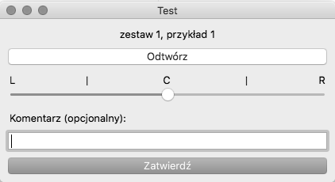

# Simple app for psychoacoustic testing of phantom source shift

This is an app I wrote for my thesis project. I investigated perception of horizontal direction of played stereo recording sample.



## Dependencies

This app requires at least Python 3.

### Windows

Warning: GUI requires calibration on Windows. Guidelines are currently a bit misplaced.

Note: For ASIO support install PyAudio from 
<https://www.lfd.uci.edu/~gohlke/pythonlibs/#pyaudio> and `pip install` it first. 

`pip install -r requirements.txt` in your python environment

### Mac OS X

```sh
brew install portaudio
pip install -r requirements.txt # in your python environment
```

## Stand-alone

To prepare stand-alone executables use [PyInstaller](http://www.pyinstaller.org). 
Check documentation for compatibility between OS versions.

```sh
pip install pyinstaller
pyinstaller testapp.py
```

